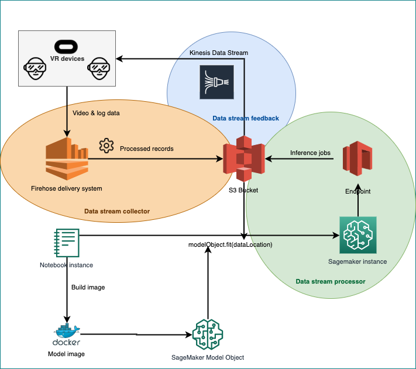

# RACe-VR

Please open a SageMaker instance on AWS and clone this git folder.

Then open the get_data notebook to pull the data from WISDM. This data is needed in order to run the experiment. Please ensure that the S3 bucket name is correct, and that you have access to it.

Running the ModelTrainDeploy notebook will do everything for you, provided that you have access to the S3 buckets. Otherwise, replace the S3 bucket path with one you have access to.

Finally, you can upload your own test data (assuming they have a suitable structure) and push it to the endpoint to obtain the predicted results. In misc, you can find an example test file from WISDM.

The image below presents an architecture of the entire system. This repository runs an experiment using WISDM data for the Data Stream Processor.

